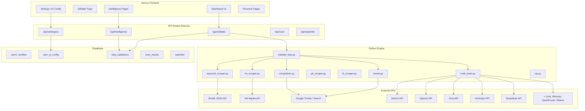
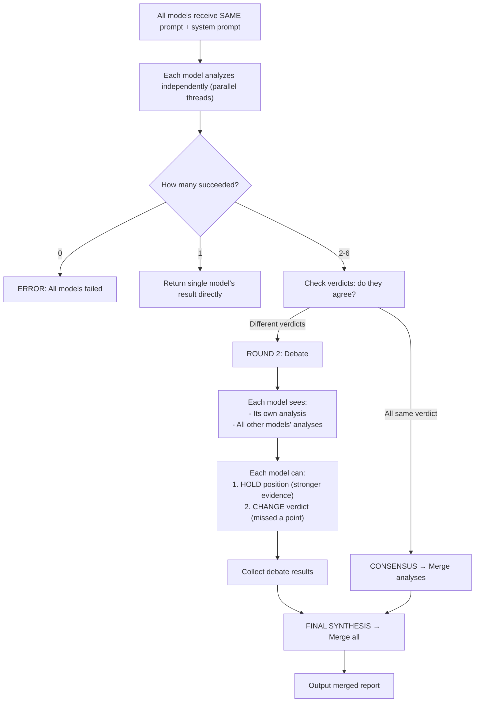
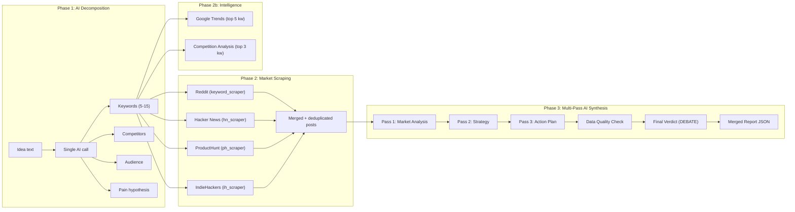
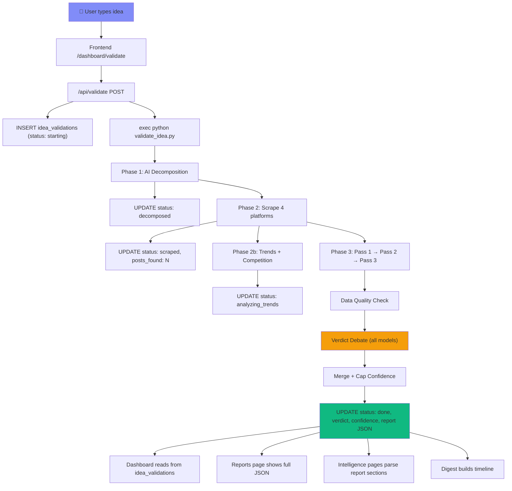

# RedditPulse — Complete System Cartography

## Table of Contents
1. [Architecture Overview](#1-architecture-overview)
2. [Tool Map — All Pages & Functions](#2-tool-map)
3. [AI Model Setup — What the AI Sees](#3-ai-model-setup)
4. [Debate Engine — How Models Fight](#4-debate-engine)
5. [Scraper Architecture](#5-scraper-architecture)
6. [Validation Pipeline — Phase by Phase](#6-validation-pipeline)
7. [Report Structure — Every Field Explained](#7-report-structure)
8. [Data Quality System](#8-data-quality-system)
9. [Data Flow Diagram](#9-data-flow-diagram)

---

## 1. Architecture Overview



---

## 2. Tool Map

### Core Tools
| Page | Route | Function | Data Source |
|------|-------|----------|-------------|
| **Validate** | `/dashboard/validate` | Submit idea → get scored report | `idea_validations` table |
| **Explore** | `/dashboard/explore` | Browse community ideas | `ideas` table |
| **Scans** | `/dashboard/scans` | Keyword scan across Reddit | `scan_results` table |
| **Settings** | `/dashboard/settings` | AI model config + profile | `user_ai_config` table |

### Intelligence Tools (auto-populated from validations)
| Page | Route | What It Shows | Source |
|------|-------|---------------|--------|
| **Trends** | `/dashboard/trends` | Market timing, pain intensity, TAM | Parsed from `report.market_analysis` |
| **WTP Detection** | `/dashboard/wtp` | Willingness-to-pay signals + pricing | Parsed from `report.market_analysis.willingness_to_pay` + `report.pricing_strategy` |
| **Competitors** | `/dashboard/competitors` | Direct/indirect competitors, saturation, moat | Parsed from `report.competition_landscape` |
| **Sources** | `/dashboard/sources` | Platforms used, post counts, AI models | Parsed from `report.data_sources` + `report.models_used` |

### Personal Tools
| Page | Route | What It Shows | Source |
|------|-------|---------------|--------|
| **Reports** | `/dashboard/reports` | Full validation reports with all sections | `idea_validations` table directly |
| **Saved** | `/dashboard/saved` | Bookmarked ideas | `watchlist` table |
| **Digest** | `/dashboard/digest` | Timeline of all findings | `idea_validations` table |
| **Watchlist** | `/dashboard/watchlist` | Tracked items | `watchlist` table |

---

## 3. AI Model Setup

### What Happens When You Add a Model

```mermaid
sequenceDiagram
    participant User
    participant Settings UI
    participant /api/settings/ai
    participant /api/settings/ai/verify
    participant Supabase
    participant AI Provider

    User->>Settings UI: Select provider + paste API key
    Settings UI->>/api/settings/ai: POST {provider, api_key, model, priority}
    /api/settings/ai->>/api/settings/ai/verify: verifyKey(provider, key, model)
    /api/settings/ai/verify->>AI Provider: Tiny test prompt "Say hello"
    AI Provider-->>/api/settings/ai/verify: Response (success/fail)
    /api/settings/ai/verify-->>/api/settings/ai: {status, message, resolved_model}
    /api/settings/ai->>Supabase: INSERT/UPDATE user_ai_config (encrypted key)
    /api/settings/ai-->>Settings UI: {ok, verification result}
    Settings UI-->>User: ✓ Model added + verification status
```

### Supported Providers (9 total)

| Provider | Models Available | Max Tokens | Temperature | Special |
|----------|----------------|------------|-------------|---------|
| **Gemini** | 3.1 Pro, 3.1 Flash-Lite, 3 Flash | 16,384 | 0.3 | Uses `system_instruction` field |
| **Anthropic** | Opus 4.6, Sonnet 4.6, Haiku 4.5 | 16,384 | 0.3 | Uses `system` parameter |
| **OpenAI** | GPT-5.4, GPT-5.3 Codex, GPT-5.2 | 16,384 | 0.3 | Standard chat format |
| **Groq** | Llama 4 Scout, Llama 3.3 70B, Llama 3.1 8B | **8,192** | 0.3 | Hard API limit, fastest inference |
| **Grok** | 4.1, 4.1 Fast | 16,384 | 0.3 | x.ai API |
| **DeepSeek** | V4, V3.2 Speciale, Reasoner | 16,384 | 0.3 | Model name remapping |
| **Minimax** | MiniMax-01 | Default | 0.3 | Custom API format |
| **OpenRouter** | Claude 3.5 Sonnet, GPT-4o, Qwen3 480B, Llama 405B, Mixtral 8x22B, DeepSeek V3, Gemini 2.0 Flash | 16,384 | 0.3 | Meta-provider, routes to others |
| **Ollama** | Custom (local) | Default | — | Self-hosted, needs `endpoint_url` |

### Model Name Resolution
Stale/wrong model names auto-correct via `MODEL_ALIASES`:
```
gemini-3.1-pro → gemini-2.0-flash
claude-opus-4.6 → claude-sonnet-4-20250514
gpt-5.2 → gpt-4o
deepseek-v4 → deepseek-chat
```

### Config Rules
- **Max 6 active agents** per user
- **Priority 1-6** — lower number = higher priority
- **API keys encrypted** in Supabase (via `upsert_ai_config_encrypted` RPC)
- **Keys masked** on frontend: `•••••••••XXXX` (last 4 chars only)
- **Rate limit**: max 10 config changes per hour
- **Premium required** for all AI features

---

## 4. Debate Engine

### How Models Debate — Step by Step



### What Each Model Receives

**Round 1 — Independent Analysis:**
- System prompt (role instructions + JSON schema)
- User prompt with: idea text, audience, pain hypothesis, competitors, keywords, scraped posts data, trend data, competition data

**Round 2 — Debate (only if verdicts disagree):**
```
Your colleague AI models analyzed the SAME data and reached DIFFERENT conclusions.

YOUR ORIGINAL ANALYSIS:
{your JSON result}

OTHER MODELS' ANALYSES:
=== gemini/gemini-2.0-flash (Verdict: BUILD IT) ===
{their full JSON}
=== groq/llama-3.3-70b (Verdict: RISKY) ===
{their full JSON}

Given this disagreement, reconsider your verdict. You may:
1. HOLD your position if you believe your evidence is stronger
2. CHANGE your verdict if a colleague raised a point you missed
```

### Merge Rules (`_merge_analyses`)

| Field | Merge Strategy |
|-------|---------------|
| **Verdict** | Majority vote (most common verdict wins) |
| **Confidence** | Average of all models' confidence scores |
| **Evidence** | Union of all models' evidence, deduplicated by first 200 chars |
| **Suggestions** | Union, deduplicated by first 200 chars |
| **Risk factors** | Union, deduplicated |
| **Action plan** | Union, deduplicated |
| **Top posts** | Union, deduplicated by title |
| **Text fields** (summary, audience_validation, competitor_gaps, etc.) | **Pick longest** version across all models |

### Single Call (non-debate)
For Phase 1-3, models are called one at a time via **round-robin**:
```
Call 1 → Model A (priority 1)
Call 2 → Model B (priority 2)
Call 3 → Model C (priority 3)
Call 4 → Model A again
...
```
This distributes load evenly across configured models.

---

## 5. Scraper Architecture

### Reddit Scraper ([keyword_scraper.py](file:///c:/Users/PC/Desktop/youcef/A/RedditPulse/engine/keyword_scraper.py))
- **API**: Reddit public JSON (`reddit.com/search.json`)
- **Method**: Global search + subreddit-specific search
- **Query format**: `"keyword1" OR keyword2 OR "keyword 3"`
- **Time window**: Last month (`t=month`)
- **Rate management**: Random user-agent rotation, sleep on 429
- **Spam filter**: Regex patterns for affiliate links, promo codes, [removed]
- **Scoring**: `score * 2 + num_comments * 3` (comments weighted higher = real engagement)
- **Scan durations**: 10min, 1h, 10h, 48h (continuous collection loops)

### HN Scraper ([hn_scraper.py](file:///c:/Users/PC/Desktop/youcef/A/RedditPulse/engine/hn_scraper.py))
- **API**: HN Algolia API (free, no auth)
- **Focus**: `Ask HN` + `Show HN` posts (highest signal)
- **Retries**: 3 attempts with exponential backoff on 429

### Competition Analyzer ([competition.py](file:///c:/Users/PC/Desktop/youcef/A/RedditPulse/engine/competition.py))
- **Method**: Google Search result count estimation
- **Queries**: `site:g2.com/products "keyword"` + `site:producthunt.com/posts "keyword"` + `"keyword" alternative`
- **Tiers**: BLUE_OCEAN (≤5 products) → EMERGING (≤20) → COMPETITIVE (≤100) → SATURATED (100+)
- **Switch demand**: alternatives_searches > 50K = high demand

### Google Trends ([trends.py](file:///c:/Users/PC/Desktop/youcef/A/RedditPulse/engine/trends.py))
- **API**: pytrends (free wrapper for Google Trends)
- **Timeframe**: Last 12 months by default
- **Classification**: Recent 3 months avg vs older 9 months avg
- **Tiers + Score Multipliers**:

| Tier | Change | Multiplier |
|------|--------|-----------|
| EXPLODING | > +50% | 1.8x |
| GROWING | > +15% | 1.4x |
| STABLE | -15% to +15% | 1.0x |
| DECLINING | -40% to -15% | 0.7x |
| DEAD | < -40% or interest ≤5 | 0.3x |

### ICP Detector ([icp.py](file:///c:/Users/PC/Desktop/youcef/A/RedditPulse/engine/icp.py))
- Aggregates persona data from AI-analyzed posts
- Outputs: primary persona, tools mentioned + sentiment, budget signals, pain intensity distribution

---

## 6. Validation Pipeline



### The 4 System Prompts (What the AI Sees)

#### Pass 1 System: Market Research Analyst
**Role**: "You are a market research analyst"
**Task**: Analyze scraped posts for pain validation, WTP signals, market timing, TAM
**Output JSON**:
- `pain_validated` (bool)
- `pain_description` (exact quotes from posts)
- `pain_frequency` (daily/weekly/monthly)
- `pain_intensity` (LOW/MEDIUM/HIGH)
- `willingness_to_pay` (specific $ signals or "No explicit WTP signals found")
- `market_timing` (GROWING/STABLE/DECLINING)
- `tam_estimate` (rough TAM with reasoning)
- `evidence[]` (min 5 posts with exact titles, source, score, insight)

**Rules**: Never invent post titles. Search for "$", "I'd pay", "take my money". Reference subreddit sizes.

#### Pass 2 System: Startup Strategist
**Role**: "You are a startup strategist"
**Task**: Design ICP, competition landscape, pricing, monetization
**Output JSON**:
- `ideal_customer_profile` (persona, demographics, psychographics, where they hang out, budget, triggers)
- `competition_landscape` (direct competitors with names/prices/weaknesses, indirect, saturation, unfair advantage, moat)
- `pricing_strategy` (model + 3 tiers with $ amounts)
- `monetization_channels[]` (3 channels with timelines)

**Rules**: Reference specific competitor names/prices. ICP must be email-cold-able. Moat must be actionable.

#### Pass 3 System: Launch Advisor
**Role**: "You are a startup launch advisor"
**Task**: Create actionable build plan
**Output JSON**:
- `launch_roadmap[]` (week-by-week with real costs)
- `revenue_projections` (month 1/3/6/12 with **stated assumptions**)
- `risk_matrix[]` (min 1 technical + 1 market + 1 execution risk)
- `first_10_customers_strategy` (specific subreddits, exact outreach templates)
- `mvp_features[]` (max 4-5)
- `cut_features[]`

**Rules**: CONSERVATIVE estimates. Real costs. Name specific subreddits.

#### Verdict System: Venture Analyst
**Role**: "You are a venture analyst delivering a final verdict"
**Task**: Synthesize all 3 passes into BUILD IT / RISKY / DON'T BUILD
**Scoring Rules**:
- **BUILD IT** = 50+ posts, multi-platform, WTP mentions, growing trends, clear gaps
- **RISKY** = 20-50 posts, few WTP, unclear differentiation, mixed trends
- **DON'T BUILD** = <20 posts, no WTP, saturated, declining trends
- Must be *brutally honest*

---

## 7. Report Structure

Every completed validation produces this JSON:

```json
{
  "verdict": "BUILD IT | RISKY | DON'T BUILD",
  "confidence": 0-100,
  "executive_summary": "4-5 sentence data-driven summary",

  "market_analysis": {
    "pain_validated": true/false,
    "pain_description": "exact quotes from posts",
    "pain_frequency": "daily/weekly/monthly",
    "pain_intensity": "LOW/MEDIUM/HIGH",
    "willingness_to_pay": "$ signals or 'No explicit WTP signals found'",
    "market_timing": "GROWING/STABLE/DECLINING",
    "tam_estimate": "rough estimate with reasoning",
    "evidence": [{"post_title", "source", "score", "what_it_proves"}]
  },

  "ideal_customer_profile": {
    "primary_persona": "who exactly",
    "demographics": "age, income, tech level",
    "psychographics": "motivations, frustrations",
    "where_they_hang_out": ["subreddits", "communities"],
    "budget_range": "$X-$Y/mo",
    "buying_triggers": ["trigger1", "trigger2"]
  },

  "competition_landscape": {
    "direct_competitors": [{"name", "weakness", "price", "users"}],
    "indirect_competitors": ["tool — why indirect"],
    "market_saturation": "EMPTY/LOW/MEDIUM/HIGH",
    "your_unfair_advantage": "specific gap",
    "moat_strategy": "how to defend over 12 months"
  },

  "pricing_strategy": {
    "recommended_model": "freemium/subscription/etc",
    "tiers": [{"name", "price", "features[]", "purpose"}],
    "reasoning": "why this pricing"
  },

  "launch_roadmap": [{"week", "title", "tasks[]", "cost", "outcome"}],
  "revenue_projections": {"month_1/3/6/12": {"users", "paying", "mrr", "assumptions"}},
  "risk_matrix": [{"risk", "severity", "likelihood", "mitigation"}],
  "first_10_customers_strategy": {"step_1..step_5"},
  "mvp_features": ["feature1", "feature2"],
  "cut_features": ["cut1", "cut2"],
  "top_posts": [{"title", "source", "score", "relevance"}],

  "data_sources": {"reddit": N, "hackernews": N, ...},
  "platforms_used": N,
  "trends_data": {...},
  "competition_data": {...},

  "data_quality": {
    "total_posts_scraped": N,
    "minimum_recommended": 20,
    "data_sufficient": true/false,
    "confidence_was_capped": true/false,
    "original_confidence": N,
    "cap_reason": "why capped",
    "contradictions": ["WTP MISMATCH: ..."],
    "warnings": ["LOW DATA: ..."],
    "platform_warnings": [{"platform", "issue"}]
  }
}
```

---

## 8. Data Quality System

### Confidence Cap Rules

| Condition | Cap | Reason |
|-----------|-----|--------|
| < 5 posts | 30% | Extremely thin data |
| 5-9 posts | 45% | Low data |
| 10-19 posts | 65% | Below minimum 20 |
| Single platform | 55% | No cross-validation |
| No WTP + specific pricing tiers | 60% | WTP mismatch contradiction |
| Pain not validated | 50% | Weak foundation |
| Few evidence posts (< 3) | 60% | Insufficient citations |
| Declining/Dead market | 55% | High risk timing |

### Contradiction Detection (6 checks)

1. **WTP Mismatch** — Pass 1 says "no WTP" but Pass 2 has specific pricing tiers
2. **Price vs Pain** — LOW pain_intensity but highest tier > $50/mo
3. **Conversion Fantasy** — Month 12 assumes > 10% conversion (industry avg: 2-5%)
4. **Unvalidated Pain** — pain_validated = false undermines everything
5. **Declining Market** — market_timing = DECLINING/DEAD
6. **Weak Differentiation** — HIGH/MEDIUM saturation + unfair_advantage < 50 chars

### Verdict Override
If confidence capped below 40% and AI said "BUILD IT" → auto-corrected to "RISKY"

---

## 9. Data Flow Diagram



---

*Generated from source code analysis — March 2026*
